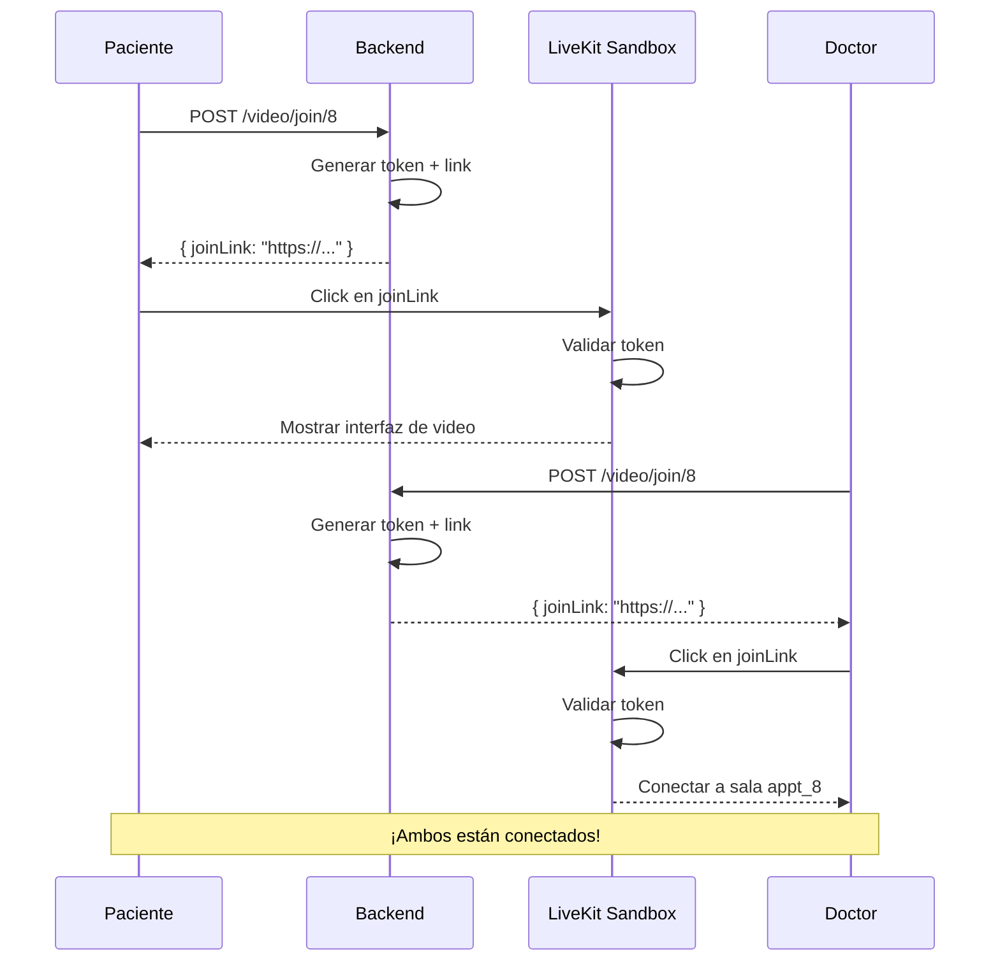

# 🎥 Link Directo para Videollamadas

## Descripción

He agregado la funcionalidad de **link directo** para unirse a videollamadas. Ahora, además de recibir las credenciales tradicionales (token, roomName, url), también recibes un **link listo para usar** que abre directamente el sandbox de LiveKit con todo preconfigurado.

---

## 🎯 Problema Anterior

**ANTES**, cuando un paciente o doctor quería unirse a una videollamada, recibía:

```json
{
  "roomName": "appt_8",
  "token": "eyJhbGciOiJIUzI1NiJ9...",
  "url": "wss://salud-sin-fronteras-t5ebkkcs.livekit.cloud"
}
```

Y tenía que:
1. Copiar el token
2. Copiar el roomName
3. Copiar la URL
4. Configurar manualmente un cliente LiveKit
5. Pegar todas las credenciales

**Esto es complicado para usuarios no técnicos.**

---

## ✅ Solución Implementada

**AHORA**, la respuesta incluye un `joinLink`:

```json
{
  "roomName": "appt_8",
  "token": "eyJhbGciOiJIUzI1NiJ9...",
  "url": "wss://salud-sin-fronteras-t5ebkkcs.livekit.cloud",
  "joinLink": "https://saludsinfronteras-2q91c9.sandbox.livekit.io/?token=eyJhbGc...&roomName=appt_8"
}
```

El usuario solo necesita:
1. **Hacer click en el link**
2. ¡Listo! Ya está en la videollamada

---

## 🚀 Cómo Usar

### Backend - Obtener el Link

```http
POST http://localhost:3000/video/join/8
Authorization: Bearer {token}
```

**Respuesta:**
```json
{
  "roomName": "appt_8",
  "token": "eyJhbGc...",
  "url": "wss://...",
  "joinLink": "https://saludsinfronteras-2q91c9.sandbox.livekit.io/?token=eyJhbGc...&roomName=appt_8"
}
```

### Frontend - Implementación Simple

#### Opción 1: Abrir en Nueva Ventana

```javascript
async function joinVideoCall(appointmentId) {
  const response = await fetch(`/video/join/${appointmentId}`, {
    method: 'POST',
    headers: {
      'Authorization': `Bearer ${localStorage.getItem('token')}`
    }
  });

  const data = await response.json();

  // Abrir el link en una nueva ventana
  window.open(data.joinLink, '_blank', 'width=1200,height=800');
}
```

#### Opción 2: Redirigir en la Misma Ventana

```javascript
async function joinVideoCall(appointmentId) {
  const response = await fetch(`/video/join/${appointmentId}`, {
    method: 'POST',
    headers: { 'Authorization': `Bearer ${token}` }
  });

  const data = await response.json();

  // Redirigir al usuario
  window.location.href = data.joinLink;
}
```

#### Opción 3: Mostrar en un Iframe (Embed)

```jsx
// React Component
import { useState } from 'react';

function VideoCallEmbed({ appointmentId }) {
  const [videoUrl, setVideoUrl] = useState(null);

  const joinCall = async () => {
    const res = await fetch(`/video/join/${appointmentId}`, {
      method: 'POST',
      headers: { 'Authorization': `Bearer ${token}` }
    });
    const data = await res.json();
    setVideoUrl(data.joinLink);
  };

  return (
    <div>
      <button onClick={joinCall}>Unirse a Videollamada</button>
      {videoUrl && (
        <iframe
          src={videoUrl}
          width="100%"
          height="600px"
          allow="camera; microphone; display-capture"
        />
      )}
    </div>
  );
}
```

#### Opción 4: Enviar por WhatsApp/Email

```javascript
async function shareVideoLink(appointmentId) {
  const response = await fetch(`/video/join/${appointmentId}`, {
    method: 'POST',
    headers: { 'Authorization': `Bearer ${token}` }
  });

  const data = await response.json();

  // Enviar por WhatsApp
  const message = encodeURIComponent(
    `Hola! Aquí está el link para tu consulta médica: ${data.joinLink}`
  );
  window.open(`https://wa.me/?text=${message}`, '_blank');

  // O copiar al portapapeles
  navigator.clipboard.writeText(data.joinLink);
  alert('Link copiado al portapapeles!');
}
```

---

## 🎨 Características del Sandbox de LiveKit

El sandbox incluye una interfaz completa de videollamada con:

| Característica | Descripción |
|---------------|-------------|
| 📹 **Video HD** | Video de alta calidad con ajuste automático |
| 🎤 **Audio** | Audio con cancelación de ruido y eco |
| 📱 **Móvil** | Funciona en iPhone, Android, tablets |
| 💻 **Compartir Pantalla** | Compartir escritorio o ventanas |
| 👥 **Múltiples Participantes** | Soporta paciente + doctor + observadores |
| 🔇 **Controles** | Silenciar/activar micrófono y cámara |
| 🖼️ **Vistas** | Vista de galería o vista enfocada |
| 📊 **Calidad** | Indicador de calidad de conexión |
| 🔐 **Seguridad** | Conexión cifrada con WebRTC |

---

## 📋 Flujo Completo de Uso

### Escenario: Paciente quiere consulta con Doctor



---

## ⚙️ Configuración

### Variables de Entorno

```bash
# .env

# LiveKit Cloud
LIVEKIT_HOST=https://salud-sin-fronteras-t5ebkkcs.livekit.cloud
LIVEKIT_WS_URL=wss://salud-sin-fronteras-t5ebkkcs.livekit.cloud
LIVEKIT_API_KEY=APIh9TFmZHVeH8F
LIVEKIT_API_SECRET=CQYNxsZRCmeTDNdX20xofnR1ZC4vJifTCQlMf8NHYOeD

# 🆕 Sandbox URL
LIVEKIT_SANDBOX_URL=https://saludsinfronteras-2q91c9.sandbox.livekit.io
```

### Cambiar Sandbox (Opcional)

Si tienes un sandbox personalizado:

```bash
LIVEKIT_SANDBOX_URL=https://mi-sandbox-personalizado.livekit.io
```

---

## 🔧 Implementación Técnica

### Código en `video.service.ts`

```typescript
async getJoinToken(appointmentId: bigint, actor: Actor) {
  // ... validaciones ...

  const jwt = await at.toJwt();

  // 🆕 Generar link directo
  const sandboxUrl = process.env.LIVEKIT_SANDBOX_URL ||
    'https://saludsinfronteras-2q91c9.sandbox.livekit.io';

  const directLink = `${sandboxUrl}/?token=${encodeURIComponent(jwt)}&roomName=${encodeURIComponent(RoomName)}`;

  return {
    roomName: RoomName,
    token: jwt,
    url: process.env.LIVEKIT_WS_URL,
    joinLink: directLink,  // 🆕 Link directo
  };
}
```

### Formato del Link

```
https://saludsinfronteras-2q91c9.sandbox.livekit.io/
  ?token=eyJhbGciOiJIUzI1NiJ9...
  &roomName=appt_8
```

**Parámetros:**
- `token`: JWT con permisos para la sala
- `roomName`: Nombre de la sala de video

---

## 📱 Uso en Diferentes Plataformas

### React/Next.js

```jsx
'use client';
import { useState } from 'react';

export default function VideoCallButton({ appointmentId }) {
  const [loading, setLoading] = useState(false);

  const handleJoin = async () => {
    setLoading(true);
    try {
      const res = await fetch(`/api/video/join/${appointmentId}`, {
        method: 'POST',
        headers: { 'Authorization': `Bearer ${token}` }
      });
      const data = await res.json();
      window.open(data.joinLink, '_blank');
    } catch (err) {
      alert('Error al unirse a la videollamada');
    } finally {
      setLoading(false);
    }
  };

  return (
    <button onClick={handleJoin} disabled={loading}>
      {loading ? 'Conectando...' : '📹 Unirse a Videollamada'}
    </button>
  );
}
```

### Vue.js

```vue
<template>
  <button @click="joinCall" :disabled="loading">
    {{ loading ? 'Conectando...' : '📹 Unirse a Videollamada' }}
  </button>
</template>

<script setup>
import { ref } from 'vue';

const props = defineProps(['appointmentId']);
const loading = ref(false);

async function joinCall() {
  loading.value = true;
  try {
    const res = await fetch(`/api/video/join/${props.appointmentId}`, {
      method: 'POST',
      headers: { 'Authorization': `Bearer ${token}` }
    });
    const data = await res.json();
    window.open(data.joinLink, '_blank');
  } catch (err) {
    alert('Error al unirse a la videollamada');
  } finally {
    loading.value = false;
  }
}
</script>
```

### Angular

```typescript
import { Component } from '@angular/core';
import { HttpClient } from '@angular/common/http';

@Component({
  selector: 'app-video-call',
  template: `
    <button (click)="joinCall()" [disabled]="loading">
      {{ loading ? 'Conectando...' : '📹 Unirse a Videollamada' }}
    </button>
  `
})
export class VideoCallComponent {
  loading = false;

  constructor(private http: HttpClient) {}

  joinCall() {
    this.loading = true;
    this.http.post<any>('/api/video/join/8', {}, {
      headers: { 'Authorization': `Bearer ${token}` }
    }).subscribe({
      next: (data) => {
        window.open(data.joinLink, '_blank');
        this.loading = false;
      },
      error: () => {
        alert('Error al unirse a la videollamada');
        this.loading = false;
      }
    });
  }
}
```

---

## 🧪 Cómo Probar

### Prueba Manual

1. **Obtener link del paciente:**
   ```bash
   curl -X POST http://localhost:3000/video/join/8 \
     -H "Authorization: Bearer {patientToken}"
   ```

2. **Obtener link del doctor:**
   ```bash
   curl -X POST http://localhost:3000/video/join/8 \
     -H "Authorization: Bearer {doctorToken}"
   ```

3. **Abrir ambos links:**
   - Abre el link del paciente en Chrome
   - Abre el link del doctor en Firefox (o ventana de incógnito)

4. **Resultado:**
   - Ambos deben verse conectados en la misma sala
   - Pueden habilitar cámara/micrófono
   - Pueden compartir pantalla

### Prueba con el Archivo HTTP

Usa el archivo **[test-video-joinlink.http](../test-video-joinlink.http)** que incluye:

- ✅ Ejemplos de peticiones
- ✅ Respuestas esperadas
- ✅ Casos de uso
- ✅ Integración en frontend

---

## 🎉 Ventajas del Link Directo

| Ventaja | Descripción |
|---------|-------------|
| ✅ **Simplicidad** | Un solo click para unirse |
| ✅ **Sin Configuración** | No requiere configurar credenciales manualmente |
| ✅ **Compartible** | Se puede enviar por WhatsApp, Email, SMS |
| ✅ **Universal** | Funciona en cualquier navegador moderno |
| ✅ **Móvil** | Funciona en iOS y Android |
| ✅ **No Requiere App** | No necesita instalar nada |
| ✅ **Profesional** | Sandbox de LiveKit con interfaz pulida |
| ✅ **Seguro** | Token con TTL de 1 hora, solo válido para una sala |

---

## 🔐 Seguridad

### Tokens Únicos por Usuario

Cada usuario recibe un token diferente con su identidad:

```json
// Paciente recibe:
{
  "token": "eyJ...PATIENT_20...",
  "joinLink": "https://...?token=eyJ...PATIENT_20..."
}

// Doctor recibe:
{
  "token": "eyJ...DOCTOR_2...",
  "joinLink": "https://...?token=eyJ...DOCTOR_2..."
}
```

### Expiración de Tokens

Los tokens expiran después de **1 hora**. Si el usuario intenta usar un link vencido, verá un error.

### Permisos

El token incluye permisos específicos:
- `roomJoin: true` - Puede unirse a la sala
- `canPublish: true` - Puede enviar video/audio
- `canSubscribe: true` - Puede recibir video/audio

---

## 📊 Monitoreo

Puedes ver las salas activas en el dashboard de LiveKit:

https://cloud.livekit.io/projects/salud-sin-fronteras-t5ebkkcs

---

## 🚨 Troubleshooting

### "Link no funciona"

**Causas posibles:**
1. Token expirado (TTL: 1 hora)
2. URL del sandbox incorrecta
3. Navegador bloqueó permisos de cámara/micrófono

**Solución:**
1. Generar un nuevo link
2. Verificar `LIVEKIT_SANDBOX_URL` en `.env`
3. Habilitar permisos en el navegador

### "Permission denied"

**Causa:** El navegador bloqueó el acceso a cámara/micrófono

**Solución:**
- Chrome: Click en el candado → Permisos → Permitir cámara y micrófono
- Firefox: Click en el icono de permisos → Permitir
- Safari: Configuración → Privacidad → Cámara/Micrófono

### "Room not found"

**Causa:** La sala no existe en LiveKit

**Solución:**
1. Ejecutar `POST /video/join/:id` para crear la sala automáticamente
2. Verificar que `LIVEKIT_HOST` esté correctamente configurado

---

## 🎁 Bonus: Personalización del Sandbox

Si quieres personalizar la apariencia del sandbox, LiveKit ofrece:

### Temas Personalizados

```
https://your-sandbox.livekit.io/
  ?token=...
  &roomName=...
  &theme=dark          // Tema oscuro
  &layout=grid         // Layout en cuadrícula
  &showStats=true      // Mostrar estadísticas
```

### Crear Tu Propio Frontend

Puedes crear tu propio cliente usando LiveKit React Components:

```bash
npm install @livekit/components-react livekit-client
```

Ver: https://docs.livekit.io/guides/client-sdk-web/

---

## ✅ Resumen

- ✅ **Agregado campo `joinLink`** en la respuesta de `/video/join/:id`
- ✅ **Link directo al sandbox** de LiveKit con credenciales incluidas
- ✅ **Un solo click** para unirse a la videollamada
- ✅ **Compartible** por WhatsApp, Email, SMS
- ✅ **Funciona en cualquier dispositivo** (PC, móvil, tablet)
- ✅ **No requiere configuración** por parte del usuario

¡Ahora tus usuarios pueden unirse a videollamadas con un solo click! 🎉
