# 📦 FASE 3: Sistema de Suscripciones (Simulado)

## 🎯 Objetivo

Implementar un sistema completo de suscripciones sin servicios de pago externos (100% gratuito). Simula pagos para pruebas y desarrollo, permitiendo gestionar planes Basic, Professional y Premium.

---

## 📋 ¿Qué se implementó?

### 1. **Servicios**

#### **PlansService** [`src/subscriptions/plans.service.ts`](src/subscriptions/plans.service.ts)
Gestiona los 3 planes disponibles en la plataforma:

**Planes disponibles:**
- **Basic** (Gratuito): 5 consultas/mes, chat de texto
- **Professional** ($29.99/mes): 20 consultas/mes, videollamadas HD, soporte 24/7
- **Premium** ($99.99/mes): Consultas ilimitadas, grabación, segunda opinión, IA

**Métodos principales:**
```typescript
async findAll(): Promise<PlanResponseDto[]>
// Retorna todos los planes activos ordenados por precio

async findOne(id: bigint): Promise<PlanResponseDto>
// Busca un plan específico por ID

async findByName(name: string): Promise<PlanResponseDto | null>
// Busca plan por nombre (útil para asignar plan Basic)

async seedPlans(): Promise<{ message: string; plans: PlanResponseDto[] }>
// Crea los 3 planes iniciales (ejecutar una sola vez)
```

#### **SubscriptionsService** [`src/subscriptions/subscriptions.service.ts`](src/subscriptions/subscriptions.service.ts)
Gestiona las suscripciones de usuarios con checkout simulado.

**Métodos principales:**
```typescript
async mockCheckout(userId: bigint, dto: MockCheckoutDto): Promise<SubscriptionResponseDto>
// Simula un pago exitoso y crea la suscripción
// Validaciones:
//   - Plan debe existir y estar activo
//   - Usuario no debe tener otra suscripción activa
//   - Calcula ExpiresAt basado en DurationMonths (1-12 meses)

async getMySubscription(userId: bigint): Promise<SubscriptionResponseDto>
// Obtiene la suscripción activa del usuario
// Si no tiene suscripción, asigna automáticamente plan Basic
// Si la suscripción expiró, la desactiva y asigna plan Basic

async cancelSubscription(userId: bigint): Promise<SubscriptionResponseDto>
// Desactiva la auto-renovación (AutoRenew = false)
// La suscripción sigue activa hasta ExpiresAt
// No se puede cancelar el plan Basic

async getSubscriptionHistory(userId: bigint): Promise<SubscriptionResponseDto[]>
// Retorna todas las suscripciones del usuario (activas e inactivas)

async checkAppointmentLimit(userId: bigint): Promise<{ hasLimit: boolean; remaining: number | null }>
// Calcula cuántas citas le quedan al usuario este mes
// Plan Premium retorna hasLimit=false, remaining=null
```

---

### 2. **DTOs** (Validación de datos)

#### **MockCheckoutDto** [`src/subscriptions/dto/mock-checkout.dto.ts`](src/subscriptions/dto/mock-checkout.dto.ts)
```typescript
{
  PlanId: number;           // ID del plan (1=Basic, 2=Professional, 3=Premium)
  DurationMonths?: number;  // 1-12 meses (default: 1)
}
```

#### **PlanResponseDto** [`src/subscriptions/dto/subscription-response.dto.ts`](src/subscriptions/dto/subscription-response.dto.ts)
```typescript
{
  Id: string | bigint;
  Name: string;             // "Basic", "Professional", "Premium"
  PriceCents: number;       // 0, 2999, 9999
  Currency: string;         // "USD"
  FeaturesJson: string[];   // ["5 consultas médicas por mes", ...]
  MaxAppointments: number | null;  // 5, 20, null (ilimitado)
  IsActive: boolean;
  CreatedAt: Date;
  FormattedPrice?: string;  // "Gratis", "$29.99 USD/mes"
}
```

#### **SubscriptionResponseDto**
```typescript
{
  Id: string | bigint;
  UserId: string | bigint;
  PlanId: string | bigint;
  StartAt: Date;
  ExpiresAt: Date | null;   // null para plan Basic
  IsActive: boolean;
  AutoRenew: boolean;       // true para planes de pago
  CreatedAt: Date;
  UpdatedAt: Date;

  Plan?: {                  // Incluido en respuestas
    Name: string;
    PriceCents: number;
    MaxAppointments: number | null;
    // ...
  };
}
```

---

### 3. **Endpoints**

#### **Planes**

| Método | Ruta | Rol | Descripción |
|--------|------|-----|-------------|
| `GET` | `/plans` | `ADMIN`, `DOCTOR`, `PATIENT` | Listar todos los planes disponibles |
| `POST` | `/plans/seed` | `ADMIN` | Crear los 3 planes iniciales (ejecutar una vez) |

#### **Suscripciones**

| Método | Ruta | Rol | Descripción |
|--------|------|-----|-------------|
| `POST` | `/subscriptions/checkout` | `PATIENT` | Simular pago y crear suscripción |
| `GET` | `/subscriptions/me` | `PATIENT` | Ver mi suscripción activa |
| `GET` | `/subscriptions/history` | `PATIENT` | Ver historial completo de suscripciones |
| `GET` | `/subscriptions/appointment-limit` | `PATIENT` | Verificar cuántas citas quedan este mes |
| `DELETE` | `/subscriptions/cancel` | `PATIENT` | Cancelar auto-renovación |

---

### 4. **Ejemplos de uso**

#### **1. Seed de planes (ejecutar una sola vez)**
```bash
POST /plans/seed
Authorization: Bearer <admin-token>
```

**Respuesta:**
```json
{
  "message": "3 planes creados/verificados exitosamente",
  "plans": [
    {
      "Id": "1",
      "Name": "Basic",
      "PriceCents": 0,
      "FormattedPrice": "Gratis",
      "MaxAppointments": 5,
      "FeaturesJson": [
        "5 consultas médicas por mes",
        "Chat de texto con doctores",
        "Acceso a historial médico básico",
        "Soporte por email"
      ]
    },
    {
      "Id": "2",
      "Name": "Professional",
      "PriceCents": 2999,
      "FormattedPrice": "$29.99 USD/mes",
      "MaxAppointments": 20
    },
    {
      "Id": "3",
      "Name": "Premium",
      "PriceCents": 9999,
      "FormattedPrice": "$99.99 USD/mes",
      "MaxAppointments": null
    }
  ]
}
```

#### **2. Ver mi suscripción activa**
```bash
GET /subscriptions/me
Authorization: Bearer <patient-token>
```

**Respuesta (primera vez - asigna plan Basic automáticamente):**
```json
{
  "Id": "1",
  "UserId": "5",
  "PlanId": "1",
  "StartAt": "2025-10-20T10:00:00.000Z",
  "ExpiresAt": null,
  "IsActive": true,
  "AutoRenew": false,
  "Plan": {
    "Id": "1",
    "Name": "Basic",
    "PriceCents": 0,
    "MaxAppointments": 5
  }
}
```

#### **3. Simular checkout - Plan Professional**
```bash
POST /subscriptions/checkout
Authorization: Bearer <patient-token>
Content-Type: application/json

{
  "PlanId": 2,
  "DurationMonths": 1
}
```

**Respuesta:**
```json
{
  "Id": "2",
  "UserId": "5",
  "PlanId": "2",
  "StartAt": "2025-10-20T10:00:00.000Z",
  "ExpiresAt": "2025-11-20T10:00:00.000Z",
  "IsActive": true,
  "AutoRenew": true,
  "Plan": {
    "Name": "Professional",
    "PriceCents": 2999,
    "MaxAppointments": 20
  }
}
```

#### **4. Verificar límite de citas**
```bash
GET /subscriptions/appointment-limit
Authorization: Bearer <patient-token>
```

**Respuesta (plan Professional con 2 citas agendadas este mes):**
```json
{
  "hasLimit": true,
  "remaining": 18
}
```

**Respuesta (plan Premium - ilimitado):**
```json
{
  "hasLimit": false,
  "remaining": null
}
```

#### **5. Cancelar suscripción**
```bash
DELETE /subscriptions/cancel
Authorization: Bearer <patient-token>
```

**Respuesta:**
```json
{
  "Id": "2",
  "AutoRenew": false,
  "ExpiresAt": "2025-11-20T10:00:00.000Z",
  "message": "Suscripción cancelada. Seguirás teniendo acceso hasta el 2025-11-20."
}
```

---

## 🔒 Seguridad y Validaciones

### **1. Validaciones automáticas (class-validator)**
```typescript
// MockCheckoutDto
PlanId: number          // @IsNumber() - Requerido
DurationMonths: 1-12    // @Min(1) @Max(12) - Opcional (default: 1)
```

### **2. Validaciones de negocio**
- ✅ El plan debe existir y estar activo
- ✅ No se permite tener 2 suscripciones activas simultáneamente
- ✅ Solo pacientes pueden crear suscripciones
- ✅ No se puede cancelar el plan Basic (gratuito)
- ✅ Las suscripciones expiradas se desactivan automáticamente

### **3. Permisos por rol**
```typescript
// Planes (público para usuarios autenticados)
GET /plans → ADMIN, DOCTOR, PATIENT

// Suscripciones (solo pacientes)
POST /subscriptions/checkout → PATIENT
GET /subscriptions/me → PATIENT
DELETE /subscriptions/cancel → PATIENT

// Seed (solo admin)
POST /plans/seed → ADMIN
```

---

## 🧪 Testing

### **Archivo de pruebas:** [`test-subscriptions.http`](test-subscriptions.http)

**Tests incluidos:**
1. ✅ Seed de planes (ADMIN)
2. ✅ Listar todos los planes
3. ✅ Ver mi suscripción activa (auto-asigna Basic)
4. ✅ Simular checkout - Plan Professional
5. ✅ Simular checkout - Plan Premium (error: ya tienes suscripción)
6. ✅ Verificar límite de citas
7. ✅ Ver historial de suscripciones
8. ✅ Cancelar suscripción
9. ✅ Intentar cancelar plan Basic (error)
10. ✅ Validación: Plan inexistente
11. ✅ Validación: Duración inválida
12. ✅ Permisos: Solo pacientes pueden suscribirse

**Cómo ejecutar:**
1. Instala la extensión **REST Client** en VS Code
2. Reemplaza `@adminToken` y `@patientToken` con tus tokens JWT reales
3. Ejecuta los tests en orden (algunos dependen de otros)

---

## 📊 Esquema de Base de Datos

### **Tabla: Plans**
```prisma
model Plans {
  Id              BigInt     @id @default(autoincrement())
  Name            String     @unique @db.VarChar(50)
  PriceCents      Int        // 0 (Basic), 2999 (Professional), 9999 (Premium)
  Currency        String     @default("USD") @db.VarChar(10)
  FeaturesJson    Json       // Array de características
  MaxAppointments Int?       // null = ilimitado (Premium)
  IsActive        Boolean    @default(true)
  CreatedAt       DateTime   @default(now())

  Subscriptions   Subscriptions[]
}
```

### **Tabla: Subscriptions**
```prisma
model Subscriptions {
  Id        BigInt   @id @default(autoincrement())
  UserId    BigInt
  PlanId    BigInt
  StartAt   DateTime
  ExpiresAt DateTime? // null para plan Basic
  IsActive  Boolean   @default(true)
  AutoRenew Boolean   @default(false)
  CreatedAt DateTime  @default(now())
  UpdatedAt DateTime  @updatedAt

  User Users @relation(fields: [UserId], references: [Id])
  Plan Plans @relation(fields: [PlanId], references: [Id])
}
```

---

## 🚀 Flujo completo de suscripción

```mermaid
sequenceDiagram
    participant U as Usuario (PATIENT)
    participant C as Controller
    participant S as SubscriptionsService
    participant P as PlansService
    participant DB as Prisma/MySQL

    Note over U,DB: 1. SEED DE PLANES (Una sola vez)
    U->>C: POST /plans/seed (ADMIN)
    C->>P: seedPlans()
    P->>DB: upsert 3 planes
    DB-->>P: Plans creados
    P-->>C: { message, plans }
    C-->>U: 200 OK

    Note over U,DB: 2. LISTAR PLANES
    U->>C: GET /plans
    C->>P: findAll()
    P->>DB: SELECT * FROM Plans WHERE IsActive=true
    DB-->>P: [Basic, Professional, Premium]
    P-->>C: Plans formateados
    C-->>U: 200 OK

    Note over U,DB: 3. VER MI SUSCRIPCIÓN (Primera vez)
    U->>C: GET /subscriptions/me
    C->>S: getMySubscription(userId)
    S->>DB: SELECT Subscription WHERE UserId=5 AND IsActive=true
    DB-->>S: null (no tiene suscripción)
    S->>P: findByName("Basic")
    P-->>S: Plan Basic
    S->>DB: INSERT INTO Subscriptions (UserId=5, PlanId=1, ExpiresAt=null)
    DB-->>S: Subscription creada
    S-->>C: Subscription con plan Basic
    C-->>U: 200 OK

    Note over U,DB: 4. SIMULAR CHECKOUT - PROFESSIONAL
    U->>C: POST /subscriptions/checkout { PlanId: 2, DurationMonths: 1 }
    C->>S: mockCheckout(userId, dto)
    S->>P: findOne(2)
    P-->>S: Plan Professional (2999 cents)
    S->>DB: SELECT Subscription WHERE UserId=5 AND IsActive=true
    DB-->>S: Subscription Basic (IsActive=true)
    S-->>C: ConflictException (ya tienes suscripción)
    C-->>U: 409 Conflict

    Note over U,DB: 5. CANCELAR SUSCRIPCIÓN BASIC (Error)
    U->>C: DELETE /subscriptions/cancel
    C->>S: cancelSubscription(userId)
    S->>DB: SELECT Subscription WHERE UserId=5 AND IsActive=true
    DB-->>S: Subscription Basic
    S->>P: findOne(1)
    P-->>S: Plan Basic (PriceCents=0)
    S-->>C: BadRequestException (no puedes cancelar plan gratuito)
    C-->>U: 400 Bad Request

    Note over U,DB: 6. VERIFICAR LÍMITE DE CITAS
    U->>C: GET /subscriptions/appointment-limit
    C->>S: checkAppointmentLimit(userId)
    S->>S: getMySubscription(userId)
    S->>DB: SELECT Subscription WHERE UserId=5
    DB-->>S: Subscription Basic (MaxAppointments=5)
    S->>DB: SELECT COUNT(*) FROM Appointments WHERE PatientUserId=5 AND Month=current
    DB-->>S: 2 citas este mes
    S-->>C: { hasLimit: true, remaining: 3 }
    C-->>U: 200 OK
```



---

## 🛠️ Integración en producción

### **Migrar a pasarela de pagos real (Stripe/PayPal)**

Para usar esta implementación con pagos reales:

1. **Instalar SDK de Stripe:**
```bash
npm install stripe
```

2. **Modificar `SubscriptionsService.mockCheckout()`:**
```typescript
// Antes (simulado):
async mockCheckout(userId: bigint, dto: MockCheckoutDto) {
  const plan = await this.plansService.findOne(dto.PlanId);
  // ... crear suscripción directamente
}

// Después (Stripe real):
async checkout(userId: bigint, dto: CheckoutDto) {
  const plan = await this.plansService.findOne(dto.PlanId);

  // 1. Crear sesión de pago en Stripe
  const session = await this.stripe.checkout.sessions.create({
    payment_method_types: ['card'],
    line_items: [{
      price_data: {
        currency: plan.Currency.toLowerCase(),
        product_data: { name: plan.Name },
        unit_amount: plan.PriceCents,
      },
      quantity: 1,
    }],
    mode: 'subscription',
    success_url: `${process.env.FRONTEND_URL}/payment-success`,
    cancel_url: `${process.env.FRONTEND_URL}/payment-cancel`,
  });

  return { url: session.url }; // Redirigir a Stripe
}

// 2. Webhook para confirmar pago
async handleStripeWebhook(event: Stripe.Event) {
  if (event.type === 'checkout.session.completed') {
    // AQUÍ crear la suscripción en BD
    await this.prisma.subscriptions.create({ ... });
  }
}
```

3. **Actualizar endpoints:**
```typescript
@Post('subscriptions/checkout')
async checkout() {
  // Retorna URL de Stripe para redirigir
  return { url: 'https://checkout.stripe.com/...' };
}

@Post('webhooks/stripe')
async stripeWebhook(@Body() event: Stripe.Event) {
  // Procesar eventos de Stripe
}
```

---

## ✅ Checklist de implementación

- [x] PlansService con seedPlans()
- [x] SubscriptionsService con mockCheckout()
- [x] SubscriptionsController con 7 endpoints
- [x] DTOs con validaciones (MockCheckoutDto, PlanResponseDto, SubscriptionResponseDto)
- [x] SubscriptionsModule integrado en AppModule
- [x] Archivo de pruebas HTTP (test-subscriptions.http)
- [x] Documentación completa (FASE3-README.md)
- [x] Validaciones de negocio (plan activo, suscripción única, etc.)
- [x] Control de permisos (@Roles)
- [x] Manejo de expiración automático
- [x] Asignación automática de plan Basic
- [x] Cálculo de límite de citas mensual

---

## 🔍 Próximos pasos

**Fase 4:** Sistema de verificación de doctores (sin servicios externos)
- Badge de "Verificado" para doctores
- Subida de documentos de certificación
- Flujo de aprobación manual por ADMIN

**Fase 5:** Dashboard de administración
- Estadísticas de usuarios, citas, suscripciones
- Gestión de usuarios (ban, activar/desactivar)
- Logs de auditoría

**Fase 6:** MFA (Autenticación de 2 factores)
- TOTP con Google Authenticator/Authy
- Códigos QR para configuración
- Backup codes

---

## 📞 Soporte

- **Documentación:** Este archivo + comentarios en código
- **Tests:** `test-subscriptions.http`
- **Schema:** `prisma/schema.prisma`

---

**✨ Fase 3 completada exitosamente**

Sistema de suscripciones 100% funcional sin servicios externos de pago.
