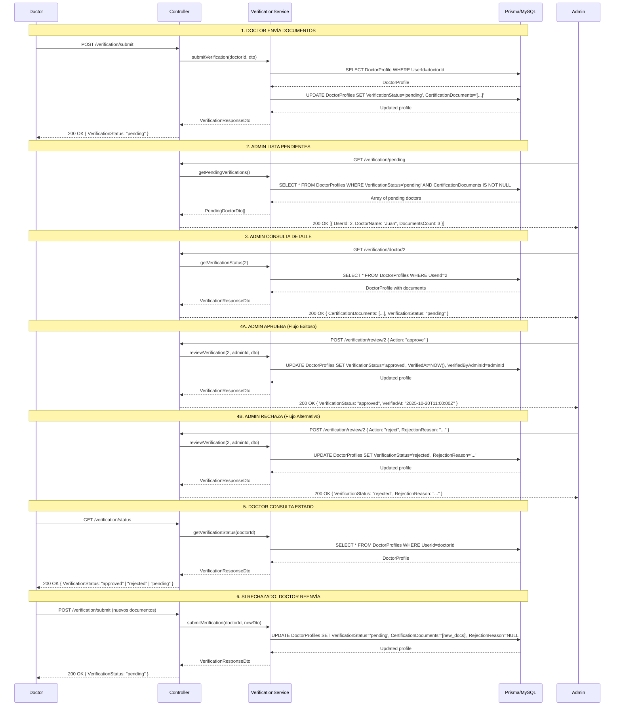

# 🏅 FASE 4: Sistema de Verificación de Doctores

## 🎯 Objetivo

Implementar un sistema completo de verificación de doctores mediante documentos, permitiendo que los doctores suban certificaciones y los administradores las revisen y aprueben/rechacen. Los doctores verificados obtienen un badge de "Verificado" visible en la plataforma.

---

## 📋 ¿Qué se implementó?

### 1. **Actualización del Schema de Base de Datos**

Se agregaron nuevos campos a la tabla `DoctorProfiles`:

```prisma
model DoctorProfiles {
  // Campos existentes...
  VerificationStatus       String    @default("pending")

  // 🆕 Nuevos campos de verificación
  CertificationDocuments   String?   @db.LongText  // JSON array de URLs
  VerificationNotes        String?   @db.LongText  // Notas adicionales del doctor
  VerifiedAt               DateTime? // Fecha de verificación
  VerifiedByAdminId        BigInt?   // ID del admin que verificó
  RejectionReason          String?   @db.LongText  // Razón de rechazo

  @@index([VerificationStatus])
}
```

**Estados de verificación:**
- **`pending`**: Esperando revisión del administrador (default)
- **`approved`**: Verificado exitosamente (badge visible)
- **`rejected`**: Rechazado, debe volver a enviar documentos

---

### 2. **Servicios**

#### **VerificationService** [`src/verification/verification.service.ts`](src/verification/verification.service.ts)

Gestiona todo el flujo de verificación de doctores.

**Métodos principales:**

```typescript
async submitVerification(doctorUserId: bigint, dto: SubmitVerificationDto): Promise<VerificationResponseDto>
// Doctor envía documentos de certificación (1-10 archivos)
// Cambia VerificationStatus a "pending"
// Validaciones:
//   - Solo doctores pueden enviar
//   - Debe tener DoctorProfile creado
//   - No puede reenviar si ya está aprobado

async reviewVerification(doctorUserId: bigint, adminUserId: bigint, dto: ReviewVerificationDto): Promise<VerificationResponseDto>
// ADMIN aprueba o rechaza la verificación
// Si aprueba:
//   - VerificationStatus = "approved"
//   - Establece VerifiedAt y VerifiedByAdminId
// Si rechaza:
//   - VerificationStatus = "rejected"
//   - Guarda RejectionReason
//   - Doctor puede volver a enviar documentos

async getVerificationStatus(doctorUserId: bigint): Promise<VerificationResponseDto>
// Obtiene el estado de verificación de un doctor específico
// Usado por doctor (su propio estado) o ADMIN (cualquier doctor)

async getPendingVerifications(): Promise<PendingDoctorDto[]>
// Lista doctores con VerificationStatus = "pending"
// Solo ADMIN
// Ordenados por antigüedad (los más antiguos primero)

async getVerifiedDoctors(): Promise<VerificationResponseDto[]>
// Lista doctores con VerificationStatus = "approved"
// Solo ADMIN

async getRejectedDoctors(): Promise<VerificationResponseDto[]>
// Lista doctores con VerificationStatus = "rejected"
// Solo ADMIN
```

---

### 3. **DTOs** (Validación de datos)

#### **SubmitVerificationDto** [`src/verification/dto/submit-verification.dto.ts`](src/verification/dto/submit-verification.dto.ts)

```typescript
{
  CertificationDocuments: string[];  // Array de URLs (min: 1, max: 10)
  Notes?: string;                    // Notas opcionales del doctor
}
```

**Validaciones:**
- ✅ Mínimo 1 documento
- ✅ Máximo 10 documentos
- ✅ Cada elemento debe ser un string (URL)

#### **ReviewVerificationDto** [`src/verification/dto/review-verification.dto.ts`](src/verification/dto/review-verification.dto.ts)

```typescript
{
  Action: 'approve' | 'reject';  // Acción a realizar
  AdminNotes?: string;           // Notas del admin (opcional)
  RejectionReason?: string;      // Razón de rechazo (requerido si Action = "reject")
}
```

**Validaciones:**
- ✅ Action debe ser "approve" o "reject"
- ✅ Si Action = "reject", RejectionReason es requerido

#### **VerificationResponseDto** [`src/verification/dto/verification-response.dto.ts`](src/verification/dto/verification-response.dto.ts)

```typescript
{
  UserId: string | bigint;
  DoctorName: string;
  Email: string;
  LicenseNumber: string;
  LicenseCountry: string;
  MedicalSchool?: string;
  YearsExperience?: number;

  // Estado de verificación
  VerificationStatus: 'pending' | 'approved' | 'rejected';
  CertificationDocuments?: string[];
  VerificationNotes?: string;
  RejectionReason?: string;

  // Metadata
  VerifiedAt?: Date;
  VerifiedByAdminId?: string | bigint;
  SubmittedAt: Date;
  UpdatedAt: Date;
}
```

---

### 4. **Endpoints**

| Método | Ruta | Rol | Descripción |
|--------|------|-----|-------------|
| `POST` | `/verification/submit` | `DOCTOR` | Enviar documentos de certificación |
| `GET` | `/verification/status` | `DOCTOR` | Ver mi estado de verificación |
| `GET` | `/verification/pending` | `ADMIN` | Listar doctores pendientes de verificación |
| `GET` | `/verification/approved` | `ADMIN` | Listar doctores verificados |
| `GET` | `/verification/rejected` | `ADMIN` | Listar doctores rechazados |
| `GET` | `/verification/doctor/:doctorId` | `ADMIN` | Ver estado de verificación de un doctor específico |
| `POST` | `/verification/review/:doctorId` | `ADMIN` | Aprobar o rechazar verificación |

---

### 5. **Ejemplos de uso**

#### **1. Doctor envía documentos de certificación**

```bash
POST /verification/submit
Authorization: Bearer {doctorToken}
Content-Type: application/json
```

**Body:**
```json
{
  "CertificationDocuments": [
    "uploads/licenses/medical-license-12345.pdf",
    "uploads/diplomas/medical-degree-universidad-cr.pdf",
    "uploads/certificates/specialty-cardiology.pdf"
  ],
  "Notes": "Licencia médica vigente hasta 2030. Especialidad en cardiología certificada."
}
```

**Respuesta:**
```json
{
  "UserId": "2",
  "DoctorName": "Juan Pérez",
  "Email": "doctor@telemedicina.com",
  "LicenseNumber": "MED-12345",
  "LicenseCountry": "Costa Rica",
  "MedicalSchool": "Universidad de Costa Rica",
  "YearsExperience": 5,
  "VerificationStatus": "pending",
  "CertificationDocuments": [
    "uploads/licenses/medical-license-12345.pdf",
    "uploads/diplomas/medical-degree-universidad-cr.pdf",
    "uploads/certificates/specialty-cardiology.pdf"
  ],
  "VerificationNotes": "Licencia médica vigente hasta 2030...",
  "SubmittedAt": "2025-10-20T10:00:00.000Z",
  "UpdatedAt": "2025-10-20T10:00:00.000Z"
}
```

---

#### **2. Doctor consulta su estado de verificación**

```bash
GET /verification/status
Authorization: Bearer {doctorToken}
```

**Respuesta:**
```json
{
  "UserId": "2",
  "DoctorName": "Juan Pérez",
  "VerificationStatus": "pending",
  "CertificationDocuments": ["uploads/licenses/...", ...],
  "SubmittedAt": "2025-10-20T10:00:00.000Z"
}
```

---

#### **3. ADMIN lista doctores pendientes**

```bash
GET /verification/pending
Authorization: Bearer {adminToken}
```

**Respuesta:**
```json
[
  {
    "UserId": "2",
    "DoctorName": "Juan Pérez",
    "Email": "doctor@telemedicina.com",
    "LicenseNumber": "MED-12345",
    "SubmittedAt": "2025-10-20T10:00:00.000Z",
    "DocumentsCount": 3
  },
  {
    "UserId": "5",
    "DoctorName": "María Rodríguez",
    "Email": "dra.rodriguez@telemedicina.com",
    "LicenseNumber": "MED-67890",
    "SubmittedAt": "2025-10-21T14:30:00.000Z",
    "DocumentsCount": 2
  }
]
```

---

#### **4. ADMIN consulta estado de un doctor específico**

```bash
GET /verification/doctor/2
Authorization: Bearer {adminToken}
```

**Respuesta:**
```json
{
  "UserId": "2",
  "DoctorName": "Juan Pérez",
  "Email": "doctor@telemedicina.com",
  "LicenseNumber": "MED-12345",
  "VerificationStatus": "pending",
  "CertificationDocuments": ["uploads/licenses/...", ...],
  "VerificationNotes": "Licencia médica vigente hasta 2030...",
  "SubmittedAt": "2025-10-20T10:00:00.000Z"
}
```

---

#### **5. ADMIN APRUEBA la verificación**

```bash
POST /verification/review/2
Authorization: Bearer {adminToken}
Content-Type: application/json
```

**Body:**
```json
{
  "Action": "approve",
  "AdminNotes": "Documentos verificados correctamente. Licencia médica vigente hasta 2030. Título universitario válido."
}
```

**Respuesta:**
```json
{
  "UserId": "2",
  "DoctorName": "Juan Pérez",
  "VerificationStatus": "approved",
  "VerifiedAt": "2025-10-20T11:00:00.000Z",
  "VerifiedByAdminId": "1",
  "VerificationNotes": "Documentos verificados correctamente...",
  "CertificationDocuments": ["uploads/licenses/...", ...],
  "SubmittedAt": "2025-10-20T10:00:00.000Z",
  "UpdatedAt": "2025-10-20T11:00:00.000Z"
}
```

---

#### **6. ADMIN RECHAZA la verificación**

```bash
POST /verification/review/5
Authorization: Bearer {adminToken}
Content-Type: application/json
```

**Body:**
```json
{
  "Action": "reject",
  "AdminNotes": "Documentos de baja calidad",
  "RejectionReason": "Las imágenes de la licencia médica están borrosas y no se puede leer el número de licencia con claridad. Por favor, envía fotos de mejor calidad o escanea los documentos."
}
```

**Respuesta:**
```json
{
  "UserId": "5",
  "DoctorName": "María Rodríguez",
  "VerificationStatus": "rejected",
  "RejectionReason": "Las imágenes de la licencia médica están borrosas...",
  "VerificationNotes": "Documentos de baja calidad",
  "CertificationDocuments": ["uploads/licenses/...", ...],
  "SubmittedAt": "2025-10-21T14:30:00.000Z",
  "UpdatedAt": "2025-10-21T16:00:00.000Z"
}
```

---

#### **7. Doctor rechazado reenvía documentos**

```bash
POST /verification/submit
Authorization: Bearer {doctorToken}
Content-Type: application/json
```

**Body:**
```json
{
  "CertificationDocuments": [
    "uploads/licenses/medical-license-high-quality.pdf",
    "uploads/diplomas/medical-degree-scanned.pdf"
  ],
  "Notes": "Documentos escaneados en alta calidad según solicitud del administrador."
}
```

**Respuesta:**
```json
{
  "VerificationStatus": "pending",  // ⬅️ Vuelve a "pending"
  "CertificationDocuments": [
    "uploads/licenses/medical-license-high-quality.pdf",
    "uploads/diplomas/medical-degree-scanned.pdf"
  ],
  "VerificationNotes": "Documentos escaneados en alta calidad...",
  "RejectionReason": null,  // Se limpia al reenviar
  ...
}
```

---

## 🔒 Seguridad y Validaciones

### **1. Validaciones automáticas (class-validator)**

```typescript
// SubmitVerificationDto
CertificationDocuments: string[]  // @IsArray() @ArrayMinSize(1) @ArrayMaxSize(10)
Notes: string (opcional)          // @IsString() @IsOptional()

// ReviewVerificationDto
Action: 'approve' | 'reject'      // @IsIn(['approve', 'reject'])
AdminNotes: string (opcional)     // @IsString() @IsOptional()
RejectionReason: string (condicional)  // @IsString() @IsOptional()
```

### **2. Validaciones de negocio**

- ✅ Solo usuarios con rol DOCTOR pueden enviar verificaciones
- ✅ Doctor debe tener un DoctorProfile creado
- ✅ Doctor verificado (approved) no puede reenviar documentos
- ✅ Doctor rechazado (rejected) puede reenviar documentos
- ✅ Solo ADMIN puede revisar verificaciones
- ✅ Si rechaza, debe incluir RejectionReason
- ✅ No se puede aprobar/rechazar doctor sin documentos
- ✅ Mínimo 1 documento, máximo 10 documentos

### **3. Permisos por rol**

```typescript
// Doctores
POST /verification/submit → DOCTOR
GET /verification/status → DOCTOR

// Administradores
GET /verification/pending → ADMIN
GET /verification/approved → ADMIN
GET /verification/rejected → ADMIN
GET /verification/doctor/:id → ADMIN
POST /verification/review/:id → ADMIN
```

---

## 🧪 Testing

### **Archivo de pruebas:** [`test-verification.http`](test-verification.http)

**Tests incluidos:**

1. ✅ Doctor envía documentos de certificación
2. ✅ Doctor consulta su estado de verificación
3. ✅ ADMIN lista doctores pendientes
4. ✅ ADMIN consulta estado de un doctor específico
5. ✅ ADMIN aprueba verificación
6. ✅ ADMIN lista doctores aprobados
7. ✅ ADMIN rechaza verificación con razón
8. ✅ ADMIN lista doctores rechazados
9. ✅ Doctor rechazado reenvía documentos
10. ❌ Doctor envía sin documentos (error)
11. ❌ Doctor envía más de 10 documentos (error)
12. ❌ ADMIN rechaza sin razón (error)
13. ❌ PATIENT intenta enviar verificación (error)
14. ❌ DOCTOR intenta revisar verificación (error)
15. ❌ Doctor verificado intenta reenviar (error)

**Cómo ejecutar:**
1. Instala la extensión **REST Client** en VS Code
2. Crea un perfil de doctor primero (prerequisito)
3. Reemplaza `@adminToken` y `@doctorToken` con tus tokens JWT reales
4. Reemplaza `@doctorUserId` con el ID del doctor
5. Ejecuta los tests en orden

---

## 📊 Esquema de Base de Datos

### **Tabla: DoctorProfiles (actualizada)**

```sql
-- Campos nuevos agregados
ALTER TABLE DoctorProfiles
ADD COLUMN CertificationDocuments LONGTEXT NULL COMMENT 'JSON array de URLs de documentos',
ADD COLUMN VerificationNotes LONGTEXT NULL COMMENT 'Notas del doctor sobre verificación',
ADD COLUMN VerifiedAt DATETIME NULL COMMENT 'Fecha de verificación',
ADD COLUMN VerifiedByAdminId BIGINT NULL COMMENT 'ID del admin que verificó',
ADD COLUMN RejectionReason LONGTEXT NULL COMMENT 'Razón de rechazo si aplica',
ADD INDEX IX_DP_VerificationStatus (VerificationStatus);
```

**Ejemplo de datos:**

```sql
-- Doctor pendiente de verificación
{
  "UserId": 2,
  "LicenseNumber": "MED-12345",
  "VerificationStatus": "pending",
  "CertificationDocuments": "[\"uploads/licenses/medical-license.pdf\", \"uploads/diplomas/degree.pdf\"]",
  "VerificationNotes": "Licencia vigente hasta 2030",
  "VerifiedAt": NULL,
  "VerifiedByAdminId": NULL,
  "RejectionReason": NULL
}

-- Doctor verificado
{
  "UserId": 3,
  "LicenseNumber": "MED-67890",
  "VerificationStatus": "approved",
  "CertificationDocuments": "[\"uploads/licenses/license.pdf\"]",
  "VerificationNotes": NULL,
  "VerifiedAt": "2025-10-20 11:00:00",
  "VerifiedByAdminId": 1,
  "RejectionReason": NULL
}

-- Doctor rechazado
{
  "UserId": 4,
  "LicenseNumber": "MED-11111",
  "VerificationStatus": "rejected",
  "CertificationDocuments": "[\"uploads/licenses/blurry-license.pdf\"]",
  "VerificationNotes": "Licencia escaneada",
  "VerifiedAt": NULL,
  "VerifiedByAdminId": NULL,
  "RejectionReason": "Imagen borrosa, no se puede leer el número de licencia"
}
```

---

## 🚀 Flujo completo de verificación



---

## 🎨 Integración Frontend (Recomendaciones)

### **Badge de "Verificado"**

Para mostrar el badge de verificado en el frontend:

```typescript
// Consultar estado de verificación del doctor
GET /verification/doctor/:doctorId

// Si VerificationStatus === "approved", mostrar badge
if (doctor.VerificationStatus === 'approved') {
  return <Badge icon={VerifiedIcon} text="Verificado" color="blue" />;
}
```

### **Panel de ADMIN**

```typescript
// Listar doctores pendientes con contador
GET /verification/pending

// Mostrar notificación si hay pendientes
const pendingCount = pendingDoctors.length;
if (pendingCount > 0) {
  showNotification(`${pendingCount} doctores esperando verificación`);
}
```

### **Panel de DOCTOR**

```typescript
// Mostrar estado actual
GET /verification/status

// Estados posibles:
// - "pending": "Tu verificación está siendo revisada"
// - "approved": "¡Estás verificado! Tu badge ya es visible"
// - "rejected": "Tu verificación fue rechazada. Razón: {RejectionReason}"
```

---

## ✅ Checklist de implementación

- [x] Actualizar schema de Prisma con campos de verificación
- [x] Crear VerificationService con 6 métodos principales
- [x] Crear VerificationController con 7 endpoints
- [x] Crear DTOs con validaciones (SubmitVerificationDto, ReviewVerificationDto)
- [x] Crear VerificationModule e integrar en AppModule
- [x] Archivo de pruebas HTTP (test-verification.http)
- [x] Documentación completa (FASE4-README.md)
- [x] Validaciones de negocio (rol, documentos, estados)
- [x] Control de permisos (@Roles)
- [x] Manejo de estados (pending → approved/rejected → pending)

---

## 🔍 Próximos pasos

**Fase 5:** Dashboard de administración
- Estadísticas de usuarios, citas, suscripciones
- Gestión de usuarios (ban, activar/desactivar)
- Logs de auditoría con filtros
- Gráficos y métricas

**Fase 6:** MFA (Autenticación de 2 factores)
- TOTP con Google Authenticator/Authy
- Códigos QR para configuración
- Backup codes

---

## 📞 Soporte

- **Documentación:** Este archivo + comentarios en código
- **Tests:** `test-verification.http`
- **Schema:** `prisma/schema.prisma`

---

**✨ Fase 4 completada exitosamente**

Sistema de verificación de doctores 100% funcional sin servicios externos.
